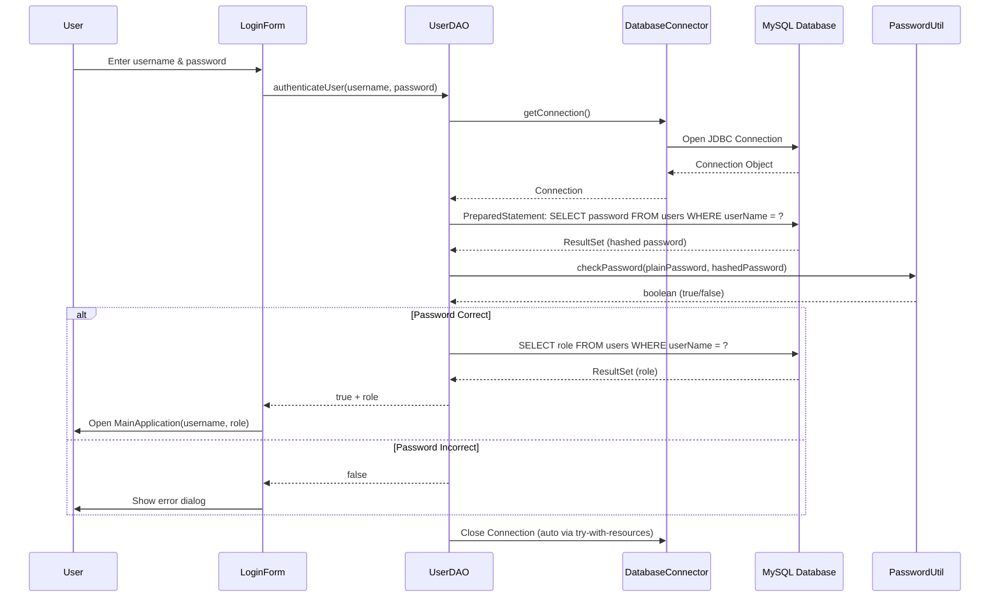
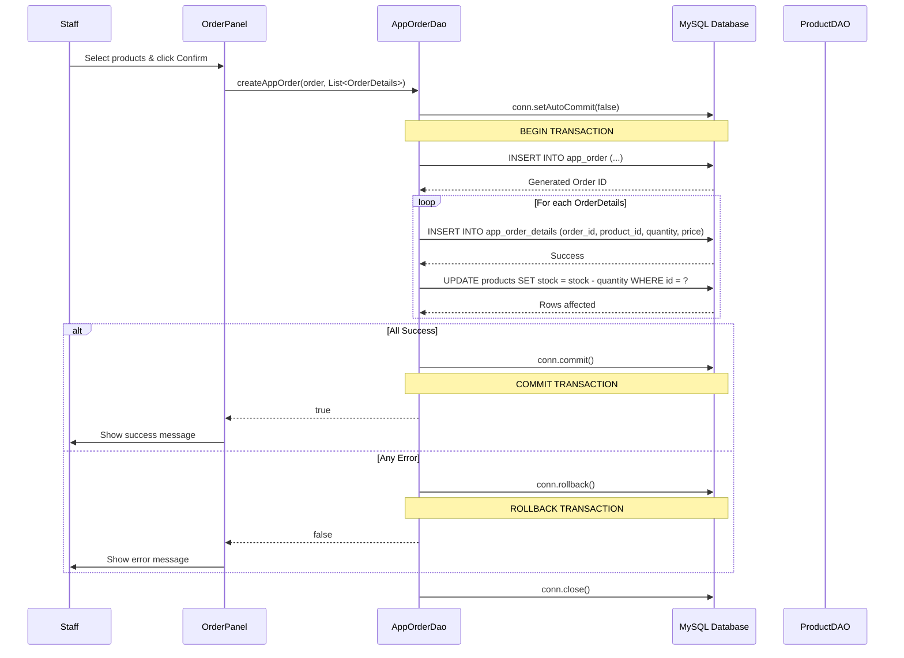
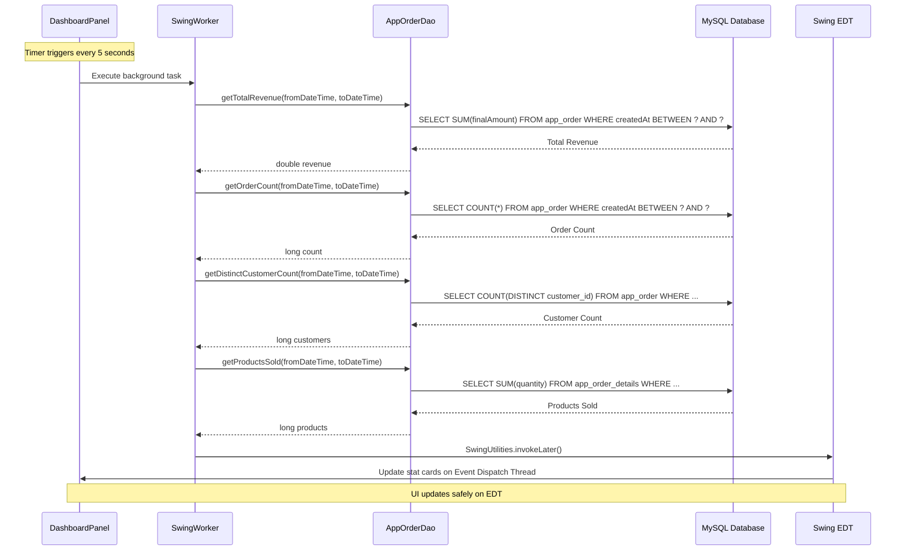
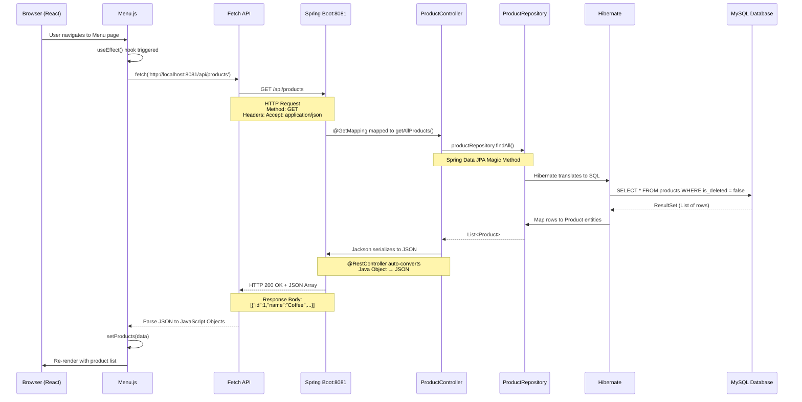
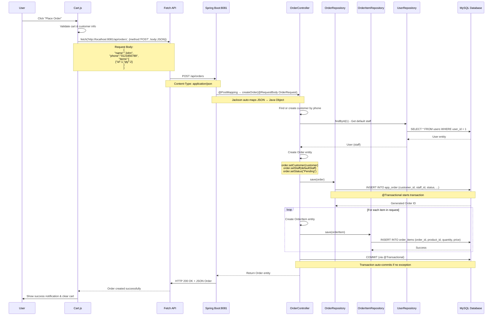
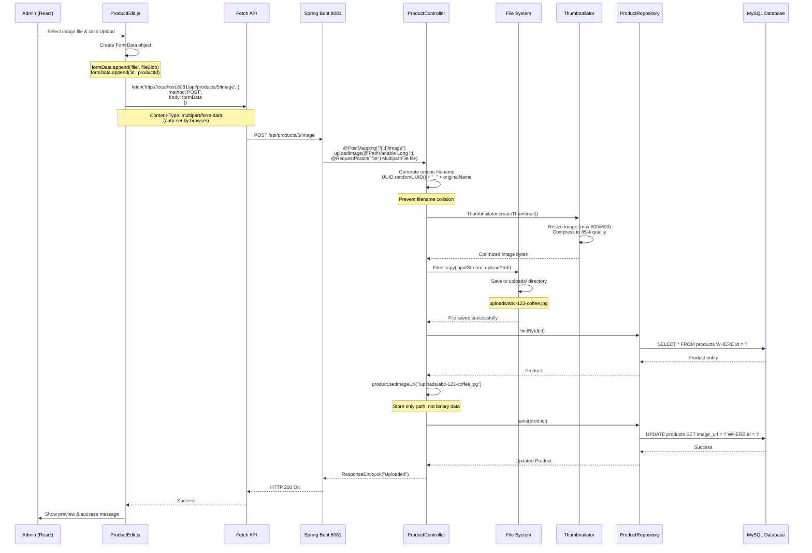
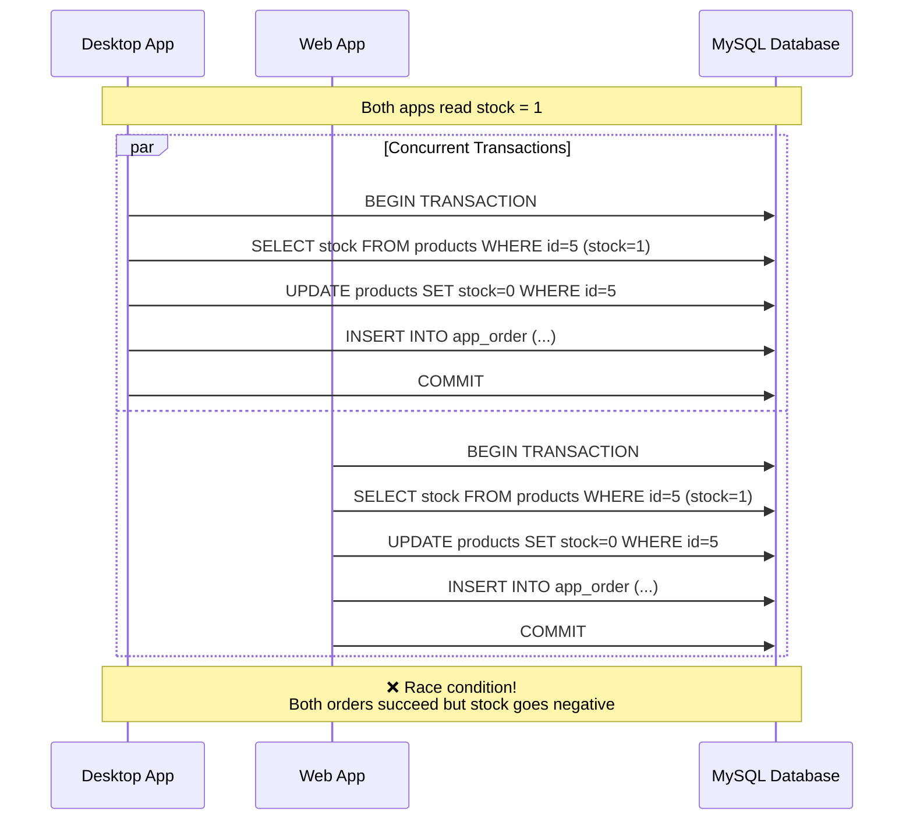
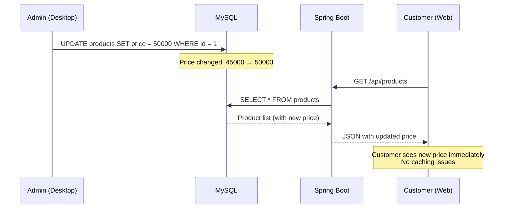
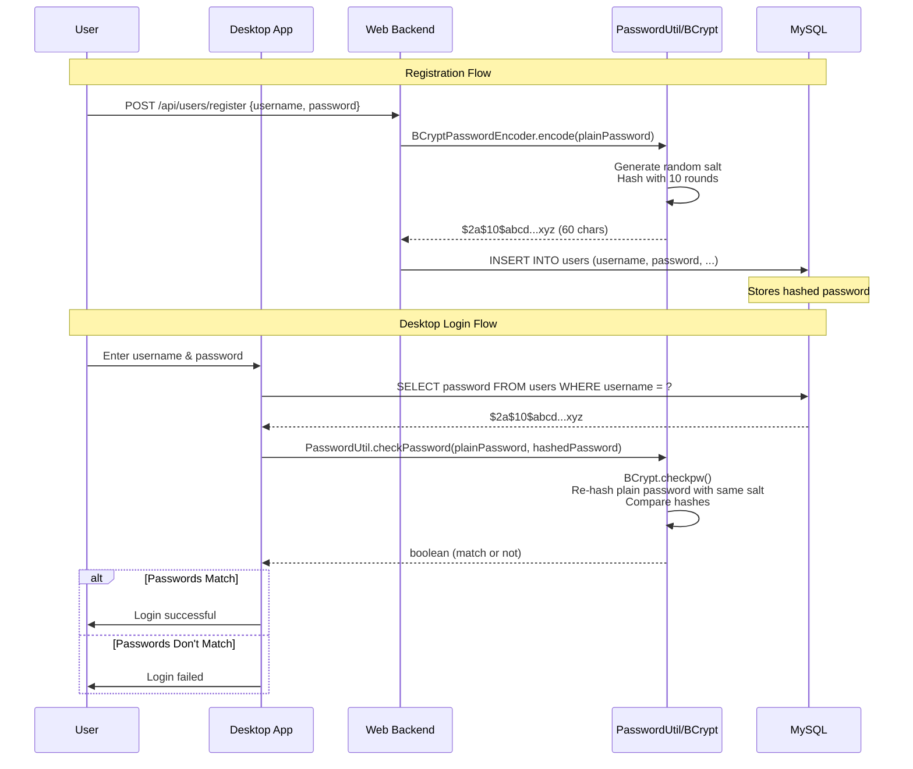
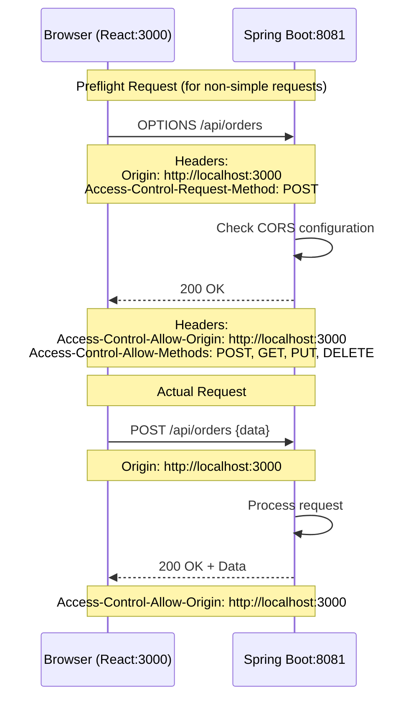

# 🏗️ KIẾN TRÚC VÀ TƯƠNG TÁC GIỮA CÁC STACK

## 📊 TỔNG QUAN KIẾN TRÚC HỆ THỐNG

```
┌────────────────────────────────────────────────────────────────────┐
│                        PRESENTATION LAYER                          │
├────────────────────┬───────────────────────────────────────────────┤
│  Desktop App       │          Web Frontend                         │
│  (Java Swing)      │          (React 19)                          │
│  Port: N/A         │          Port: 3000                          │
└────────────────────┴───────────────────────────────────────────────┘
                     │                      │
                     │ JDBC                 │ HTTP REST
                     │                      │
                     ▼                      ▼
┌────────────────────────────────────────────────────────────────────┐
│                        APPLICATION LAYER                           │
├────────────────────┬───────────────────────────────────────────────┤
│  DAO Layer         │          Spring Boot Backend                  │
│  (JDBC)            │          (REST API)                           │
│                    │          Port: 8081                           │
└────────────────────┴───────────────────────────────────────────────┘
                     │                      │
                     │ MySQL Protocol       │ JPA/Hibernate
                     │                      │
                     ▼                      ▼
┌────────────────────────────────────────────────────────────────────┐
│                          DATA LAYER                                │
│                      MySQL Database 8.x                            │
│                         Port: 3306                                 │
│              Database: shopdb (Shared Database)                    │
└────────────────────────────────────────────────────────────────────┘
```

---

## 🔄 1. DESKTOP APP ↔ DATABASE (Direct JDBC Connection)

### 1.1. Architecture Pattern: Traditional 3-Tier Architecture

```
┌─────────────────────────────────────────────────────────────┐
│                    DESKTOP APPLICATION                      │
├─────────────────────────────────────────────────────────────┤
│  Presentation Tier (View)                                   │
│  ├─ LoginForm.java                                         │
│  ├─ MainApplication.java                                   │
│  ├─ DashboardPanel.java                                    │
│  ├─ OrderPanel.java                                        │
│  ├─ ProductManagerPanel.java                              │
│  ├─ UserManagementPanel.java                              │
│  └─ RevenueReportPanel.java                               │
├─────────────────────────────────────────────────────────────┤
│  Business Logic Tier (Controller/DAO)                      │
│  ├─ UserDAO.java                                           │
│  ├─ ProductDAO.java                                        │
│  ├─ AppOrderDao.java                                       │
│  ├─ CustomerDao.java                                       │
│  └─ GetProduct.java                                        │
├─────────────────────────────────────────────────────────────┤
│  Data Access Tier (Database Connector)                     │
│  ├─ DatabaseConnector.java (Singleton)                    │
│  └─ Connection Pool Management                             │
└─────────────────────────────────────────────────────────────┘
                            │
                            │ JDBC Driver
                            │ (mysql-connector-java:8.0.32)
                            ▼
┌─────────────────────────────────────────────────────────────┐
│                    MySQL Database                           │
│                    localhost:3306                           │
│                    Database: shopdb                         │
└─────────────────────────────────────────────────────────────┘
```

### 1.2. Chi tiết tương tác JDBC

#### **Flow 1: User Authentication**



**Công nghệ sử dụng:**
- **JDBC (Java Database Connectivity)**: API chuẩn của Java để kết nối database
- **PreparedStatement**: Chống SQL Injection, pre-compiled SQL
- **Try-with-resources**: Auto-close connection (Java 7+)
- **BCrypt (jBCrypt)**: Password hashing algorithm
- **Singleton Pattern**: DatabaseConnector đảm bảo chỉ 1 instance

#### **Flow 2: Create Order (Transaction Management)**



**Công nghệ sử dụng:**
- **ACID Transactions**: Đảm bảo tính toàn vẹn dữ liệu
  - **Atomicity**: Tất cả thành công hoặc tất cả thất bại
  - **Consistency**: Database luôn ở trạng thái hợp lệ
  - **Isolation**: Các transaction không ảnh hưởng lẫn nhau
  - **Durability**: Dữ liệu committed được lưu vĩnh viễn
- **Manual Transaction Control**: `setAutoCommit(false)`, `commit()`, `rollback()`
- **Statement.RETURN_GENERATED_KEYS**: Lấy ID tự động tăng sau INSERT

#### **Flow 3: Real-time Dashboard Updates**



**Công nghệ sử dụng:**
- **SwingWorker**: Background thread để tránh freeze UI
- **SwingUtilities.invokeLater()**: Update UI thread-safe
- **javax.swing.Timer**: Schedule periodic tasks
- **Event Dispatch Thread (EDT)**: Swing's single-threaded UI model
- **SQL Aggregate Functions**: SUM(), COUNT(), AVG()

---

## 🌐 2. WEB FRONTEND ↔ BACKEND (REST API Communication)

### 2.1. Architecture Pattern: SPA + REST API

```
┌─────────────────────────────────────────────────────────────┐
│                    WEB FRONTEND (React)                     │
│                    Port: 3000                               │
├─────────────────────────────────────────────────────────────┤
│  Component Layer                                            │
│  ├─ Menu.js (Product Catalog)                             │
│  ├─ Cart.js (Shopping Cart)                               │
│  ├─ Orders.js (Order Management)                          │
│  ├─ Login.js (Customer Auth)                              │
│  └─ OrderHistory.js                                        │
├─────────────────────────────────────────────────────────────┤
│  Service Layer                                              │
│  └─ Fetch API (HTTP Client)                               │
├─────────────────────────────────────────────────────────────┤
│  State Management                                           │
│  ├─ React Context API                                      │
│  ├─ useState Hooks                                         │
│  └─ NotificationProvider (Global State)                   │
└─────────────────────────────────────────────────────────────┘
                            │
                            │ HTTP REST
                            │ JSON Format
                            │ CORS Enabled
                            ▼
┌─────────────────────────────────────────────────────────────┐
│              SPRING BOOT BACKEND (REST API)                 │
│                    Port: 8081                               │
├─────────────────────────────────────────────────────────────┤
│  Controller Layer (@RestController)                        │
│  ├─ ProductController.java                                │
│  ├─ OrderController.java                                  │
│  └─ UserController.java                                   │
├─────────────────────────────────────────────────────────────┤
│  Repository Layer (Spring Data JPA)                        │
│  ├─ ProductRepository.java                                │
│  ├─ OrderRepository.java                                  │
│  └─ OrderItemRepository.java                              │
├─────────────────────────────────────────────────────────────┤
│  Entity Layer (JPA Entities)                               │
│  ├─ Product.java (@Entity)                                │
│  ├─ Order.java (@Entity)                                  │
│  └─ OrderItem.java (@Entity)                              │
└─────────────────────────────────────────────────────────────┘
                            │
                            │ JPA/Hibernate
                            │ (ORM Layer)
                            ▼
┌─────────────────────────────────────────────────────────────┐
│                    MySQL Database                           │
└─────────────────────────────────────────────────────────────┘
```

### 2.2. Chi tiết REST API Interactions

#### **API 1: Get Product List**



**Công nghệ sử dụng:**
- **Fetch API**: Modern HTTP client (thay cho XMLHttpRequest)
- **REST Architecture**: 
  - GET = Read data
  - Stateless communication
  - Resource-based URLs
- **Jackson**: JSON serialization/deserialization (Spring Boot default)
- **Spring Data JPA**: Auto-generate queries from method names
- **Hibernate Second-Level Cache**: Optional caching layer
- **@JsonIgnore**: Hide sensitive fields in JSON response

#### **API 2: Create Order (POST Request)**



**Công nghệ sử dụng:**
- **@RequestBody**: Auto-parse JSON to Java object
- **@Transactional**: Spring manages transaction boundaries
- **Declarative Transaction Management**: No manual commit/rollback
- **Cascade Operations**: JPA auto-saves related entities
- **Optimistic Locking**: Prevent concurrent update conflicts
- **@JsonProperty**: Custom JSON field mapping

#### **API 3: Upload Product Image**



**Công nghệ sử dụng:**
- **MultipartFile**: Spring's file upload abstraction
- **FormData**: Browser API for file upload
- **Thumbnailator**: Image resizing library
- **UUID**: Unique identifier generation
- **Static Resource Serving**: `spring.mvc.static-path-pattern=/uploads/**`
- **File I/O**: Java NIO (java.nio.file.Files)
- **Path Normalization**: Prevent directory traversal attacks

---

## 🔄 3. SHARED DATABASE ACCESS (Dual Access Pattern)

### 3.1. Database Schema Shared by Both Applications

```
┌─────────────────────────────────────────────────────────────┐
│                    MySQL Database: shopdb                   │
│                         Port: 3306                          │
├─────────────────────────────────────────────────────────────┤
│  Tables (Shared Schema)                                     │
│  ├─ users                   (Staff & Admin accounts)       │
│  ├─ products                (Product catalog)              │
│  ├─ app_order               (Orders from both apps)        │
│  ├─ app_order_details       (Order line items)             │
│  ├─ customers               (Customer information)         │
│  ├─ customer_tiers          (Loyalty program tiers)        │
│  └─ order_items             (Web order items)              │
└─────────────────────────────────────────────────────────────┘
         ▲                                    ▲
         │ JDBC                               │ JPA/Hibernate
         │ Direct SQL                         │ ORM Mapping
         │                                    │
┌────────┴──────────┐              ┌─────────┴──────────────┐
│  Desktop App      │              │  Spring Boot Backend   │
│  (Direct JDBC)    │              │  (JPA Repository)      │
└───────────────────┘              └────────────────────────┘
```

### 3.2. Consistency Challenges & Solutions

#### **Challenge 1: Concurrent Order Creation**

**Scenario:** Desktop staff và Web customer đồng thời đặt cùng 1 món cuối cùng trong kho.



**Solution: Database-level locking**

```java
// Desktop App (JDBC)
String sql = "UPDATE products SET stock = stock - ? WHERE id = ? AND stock >= ?";
PreparedStatement ps = conn.prepareStatement(sql);
ps.setInt(1, quantity);
ps.setLong(2, productId);
ps.setInt(3, quantity);
int rowsAffected = ps.executeUpdate();
if (rowsAffected == 0) {
    throw new InsufficientStockException();
}
```

```java
// Spring Boot (JPA)
@Lock(LockModeType.PESSIMISTIC_WRITE)
@Query("SELECT p FROM Product p WHERE p.id = :id")
Product findByIdWithLock(@Param("id") Long id);
```

#### **Challenge 2: Data Synchronization**

**Scenario:** Desktop admin update giá sản phẩm, Web customer cần thấy giá mới ngay lập tức.



**Solution Implemented:**
- **No application-level caching**: Always read from database
- **Hibernate 2nd level cache disabled**: Fresh data every request
- **Database is single source of truth**: Both apps query directly

---

## 🔐 4. SECURITY LAYER INTERACTIONS

### 4.1. Password Hashing Flow (BCrypt)



**Công nghệ sử dụng:**
- **BCrypt**: Adaptive hashing algorithm (Blowfish-based)
- **Salt**: Random value to prevent rainbow table attacks
- **Work Factor**: 10 rounds (2^10 = 1024 iterations)
- **Desktop**: jBCrypt library
- **Web**: Spring Security BCryptPasswordEncoder
- **Compatibility**: Both implementations use same BCrypt standard

### 4.2. CORS Configuration (Web Backend)

```java
@Configuration
public class SecurityConfig {
    @Bean
    public SecurityFilterChain filterChain(HttpSecurity http) {
        http
            .cors(cors -> cors.configurationSource(request -> {
                CorsConfiguration config = new CorsConfiguration();
                config.setAllowedOrigins(List.of("http://localhost:3000")); // React app
                config.setAllowedMethods(List.of("GET", "POST", "PUT", "DELETE"));
                config.setAllowedHeaders(List.of("*"));
                return config;
            }))
            .csrf(csrf -> csrf.disable()) // Disable for REST API
            .authorizeHttpRequests(auth -> auth.anyRequest().permitAll());
        return http.build();
    }
}
```



**Concepts:**
- **Same-Origin Policy**: Browser security preventing cross-origin requests
- **CORS**: Server explicitly allows certain origins
- **Preflight Request**: OPTIONS request to check permissions
- **Credentials**: Cookies/Auth headers (not used in this project)

---

## 📊 5. DATA FLOW PATTERNS

### 5.1. Desktop App Data Flow (MVC Pattern)

```
User Input                                      Database
    │                                               │
    ▼                                               ▼
┌─────────┐         ┌─────────────┐         ┌───────────┐
│  View   │────────>│ Controller  │────────>│    DAO    │
│ (Swing) │<────────│  (Handlers) │<────────│  (JDBC)   │
└─────────┘         └─────────────┘         └───────────┘
    │                       │                       │
    │                       │                       │
    └───────> Events ───────┴────> Methods ────────┘
```

**Example: Add Product Flow**

```java
// 1. VIEW: ProductManagerPanel.java
JButton addButton = new JButton("Add Product");
addButton.addActionListener(e -> {
    // 2. CONTROLLER: Event Handler
    ProductDialog dialog = new ProductDialog(this, null);
    dialog.setVisible(true);
    
    if (dialog.isConfirmed()) {
        Product product = dialog.getProduct();
        
        // 3. DAO: Database operation
        ProductDAO dao = new ProductDAO();
        boolean success = dao.saveProduct(product);
        
        // 4. VIEW: Update UI
        if (success) {
            loadProductData(); // Refresh table
            showSuccessMessage("Product added!");
        }
    }
});
```

### 5.2. Web App Data Flow (REST + React)

```
User Input                                      Backend API                                    Database
    │                                               │                                              │
    ▼                                               ▼                                              ▼
┌─────────┐         ┌─────────────┐         ┌─────────────┐         ┌─────────────┐         ┌─────────┐
│  React  │────────>│   Fetch     │────────>│ Controller  │────────>│ Repository  │────────>│ MySQL   │
│Component│<────────│     API     │<────────│   (REST)    │<────────│    (JPA)    │<────────│   DB    │
└─────────┘         └─────────────┘         └─────────────┐         └─────────────┘         └─────────┘
    │                       │                       │                       │                       │
    │                       │                       │                       │                       │
State Updates          JSON/HTTP           @RestController           Spring Data JPA          SQL Queries
```

**Example: Place Order Flow**

```javascript
// 1. REACT COMPONENT: Cart.js
const handlePlaceOrder = async () => {
    // 2. PREPARE DATA
    const orderData = {
        name: customerName,
        phone: customerPhone,
        items: cart.map(item => ({
            id: item.id,
            qty: item.quantity
        }))
    };
    
    // 3. HTTP REQUEST
    const response = await fetch('http://localhost:8081/api/orders', {
        method: 'POST',
        headers: { 'Content-Type': 'application/json' },
        body: JSON.stringify(orderData)
    });
    
    // 4. HANDLE RESPONSE
    if (response.ok) {
        const order = await response.json();
        setOrderId(order.id);
        clearCart();
        showNotification('Order placed successfully!');
    }
};
```

```java
// 5. SPRING CONTROLLER: OrderController.java
@PostMapping
public ResponseEntity<?> createOrder(@RequestBody OrderRequest request) {
    // 6. BUSINESS LOGIC
    Order order = new Order();
    order.setCustomerName(request.getName());
    order.setCustomerPhone(request.getPhone());
    
    // 7. REPOSITORY SAVE
    Order savedOrder = orderRepository.save(order);
    
    // 8. JSON RESPONSE
    return ResponseEntity.ok(savedOrder);
}
```

---

## 🔄 6. STATE MANAGEMENT

### 6.1. Desktop App State (Swing EDT)

```java
public class OrderPanel extends JPanel {
    // Component State
    private DefaultTableModel cartModel;
    private JTextField totalTextField;
    private double currentDiscountPercent = 0.0;
    
    // Event Dispatch Thread ensures thread-safety
    SwingUtilities.invokeLater(() -> {
        // All UI updates must happen on EDT
        cartModel.addRow(newRow);
        totalTextField.setText(formattedTotal);
    });
}
```

**State Management:**
- **Component Fields**: Store state as instance variables
- **EDT (Event Dispatch Thread)**: Single-threaded UI updates
- **Observer Pattern**: Event listeners for state changes
- **Manual Synchronization**: No automatic re-rendering

### 6.2. Web Frontend State (React Hooks)

```javascript
// Component State with useState
function Cart() {
    const [cart, setCart] = useState([]);
    const [total, setTotal] = useState(0);
    
    // Context State
    const { showNotification } = useContext(NotificationContext);
    
    // Side Effects
    useEffect(() => {
        const newTotal = cart.reduce((sum, item) => 
            sum + (item.price * item.quantity), 0
        );
        setTotal(newTotal);
    }, [cart]); // Re-run when cart changes
    
    return <div>{/* UI automatically re-renders on state change */}</div>;
}
```

**State Management:**
- **Local State**: `useState` for component-level data
- **Global State**: `Context API` for app-wide data (notifications, auth)
- **Side Effects**: `useEffect` for async operations
- **Immutability**: State updates create new objects
- **Virtual DOM**: React efficiently updates only changed parts

---

## 📡 7. COMMUNICATION PROTOCOLS

### 7.1. Protocol Stack Comparison

| Layer | Desktop App | Web Frontend → Backend |
|-------|-------------|------------------------|
| **Application** | Java Method Calls | HTTP/1.1 REST |
| **Presentation** | Java Objects | JSON (Jackson) |
| **Session** | JDBC Session | Stateless HTTP |
| **Transport** | TCP (MySQL Protocol) | TCP (HTTP) |
| **Network** | IP | IP |
| **Data Link** | Ethernet | Ethernet |
| **Physical** | localhost | localhost |

### 7.2. Data Serialization

#### Desktop App (Java ↔ MySQL)

```java
// Java Object
Product product = new Product(1, "Coffee", 45000, 100);

// JDBC PreparedStatement (Binary Protocol)
PreparedStatement ps = conn.prepareStatement(
    "INSERT INTO products VALUES (?, ?, ?, ?)"
);
ps.setInt(1, product.getId());        // Binary: 4 bytes
ps.setString(2, product.getName());   // Binary: length + UTF-8 bytes
ps.setDouble(3, product.getPrice());  // Binary: 8 bytes
ps.setInt(4, product.getStock());     // Binary: 4 bytes

// MySQL stores in B-Tree format on disk
```

#### Web App (JavaScript ↔ Java)

```javascript
// JavaScript Object
const product = {
    id: 1,
    name: "Coffee",
    price: 45000,
    stock: 100
};

// JSON Serialization (Text Protocol)
const json = JSON.stringify(product);
// Result: '{"id":1,"name":"Coffee","price":45000,"stock":100}'

// HTTP POST Body (UTF-8 text)
fetch('/api/products', {
    method: 'POST',
    body: json  // Sent as text over HTTP
});
```

```java
// Spring Boot Controller
@PostMapping
public Product create(@RequestBody Product product) {
    // Jackson auto-deserializes JSON → Java Object
    return productRepository.save(product);
    // Response auto-serializes Java Object → JSON
}
```

---

## 🎯 8. INTEGRATION POINTS SUMMARY

### 8.1. Full System Interaction Map

```
┌─────────────────────────────────────────────────────────────────────────────────┐
│                              USER INTERACTIONS                                  │
├─────────────────────────────────┬───────────────────────────────────────────────┤
│      STAFF/ADMIN (Desktop)      │         CUSTOMER (Web Browser)                │
└─────────────────────────────────┴───────────────────────────────────────────────┘
                │                                        │
                │                                        │
                ▼                                        ▼
┌───────────────────────────────┐         ┌──────────────────────────────────────┐
│    DESKTOP APPLICATION        │         │       WEB FRONTEND                   │
│    (Java Swing + JDBC)        │         │       (React 19)                     │
│                               │         │                                      │
│  • LoginForm                  │         │  • Menu.js (Browse Products)         │
│  • MainApplication            │         │  • Cart.js (Shopping Cart)           │
│  • DashboardPanel             │         │  • Orders.js (Track Orders)          │
│  • OrderPanel                 │         │  • Login.js (Customer Auth)          │
│  • ProductManagerPanel        │         │                                      │
│  • UserManagementPanel        │         │  State: Context API + Hooks          │
│  • RevenueReportPanel         │         │  HTTP Client: Fetch API              │
│                               │         │                                      │
│  Direct Database Access       │         │  RESTful API Calls                   │
└───────────────┬───────────────┘         └─────────────┬────────────────────────┘
                │                                       │
                │ JDBC                                  │ HTTP REST
                │ mysql-connector-java:8.0.32           │ JSON over TCP
                │ Port: 3306                            │ Port: 8081
                │                                       │
                │                                       ▼
                │                         ┌──────────────────────────────────────┐
                │                         │     SPRING BOOT BACKEND              │
                │                         │     (REST API Server)                │
                │                         │                                      │
                │                         │  • ProductController                 │
                │                         │  • OrderController                   │
                │                         │  • UserController                    │
                │                         │                                      │
                │                         │  • ProductRepository (JPA)           │
                │                         │  • OrderRepository (JPA)             │
                │                         │                                      │
                │                         │  ORM: Hibernate 6.x                  │
                │                         │  Security: Spring Security           │
                │                         │  JSON: Jackson                       │
                │                         └─────────────┬────────────────────────┘
                │                                       │
                │                                       │ JPA/Hibernate
                │                                       │ HikariCP Pool
                │                                       │ Port: 3306
                │                                       │
                ▼                                       ▼
┌───────────────────────────────────────────────────────────────────────────────┐
│                            MYSQL DATABASE (shopdb)                            │
│                                 Port: 3306                                    │
├───────────────────────────────────────────────────────────────────────────────┤
│  Tables:                                                                      │
│  • users (Staff & Admin accounts) ─────────────────────► BCrypt passwords    │
│  • products (Shared catalog) ──────────────────────────► Inventory tracking  │
│  • app_order (Orders from both apps) ──────────────────► ACID transactions   │
│  • app_order_details (Order line items) ───────────────► Foreign keys        │
│  • customers (Customer info + loyalty tiers) ──────────► Discount calc       │
│  • order_items (Web-specific order items)                                    │
└───────────────────────────────────────────────────────────────────────────────┘
```

### 8.2. Key Integration Technologies

| Component | Desktop | Web Backend | Web Frontend |
|-----------|---------|-------------|--------------|
| **Language** | Java 22 | Java 21 | JavaScript (ES6+) |
| **UI Framework** | Swing | N/A | React 19 |
| **Web Framework** | N/A | Spring Boot 3.5.3 | React Scripts 5.0 |
| **Database Access** | JDBC (Direct SQL) | JPA/Hibernate (ORM) | Via REST API |
| **HTTP Client** | N/A | N/A | Fetch API |
| **HTTP Server** | N/A | Embedded Tomcat | N/A |
| **JSON Processing** | N/A | Jackson | Built-in JSON |
| **Dependency Injection** | Manual | Spring IoC | React Context |
| **State Management** | Manual (EDT) | Spring Beans | Hooks + Context |
| **Build Tool** | Maven | Maven | npm + Webpack |
| **Testing** | Manual | JUnit + Mockito | Jest + RTL |

---

## 🚀 9. DEPLOYMENT ARCHITECTURE

### 9.1. Current Development Setup

```
┌─────────────────────────────────────────────────────────────┐
│                   Developer Machine                         │
├─────────────────────────────────────────────────────────────┤
│                                                             │
│  ┌─────────────────┐    ┌──────────────────┐              │
│  │  Desktop App    │    │   React Dev      │              │
│  │  (IntelliJ/     │    │   Server         │              │
│  │   NetBeans)     │    │   (npm start)    │              │
│  │                 │    │                  │              │
│  │  Port: N/A      │    │  Port: 3000      │              │
│  └────────┬────────┘    └────────┬─────────┘              │
│           │                      │                         │
│           │                      │                         │
│           │              ┌───────▼──────────┐              │
│           │              │  Spring Boot     │              │
│           │              │  (IntelliJ/STS)  │              │
│           │              │                  │              │
│           │              │  Port: 8081      │              │
│           │              └───────┬──────────┘              │
│           │                      │                         │
│           ▼                      ▼                         │
│        ┌──────────────────────────────────┐               │
│        │     MySQL Server                 │               │
│        │     Port: 3306                   │               │
│        │     Database: shopdb             │               │
│        └──────────────────────────────────┘               │
│                                                             │
└─────────────────────────────────────────────────────────────┘
```

### 9.2. Production Deployment (Recommended)

```
┌─────────────────────────────────────────────────────────────────┐
│                         CLOUD INFRASTRUCTURE                    │
├─────────────────────────────────────────────────────────────────┤
│                                                                 │
│  ┌────────────────────┐                                        │
│  │  Desktop App       │                                        │
│  │  (Installed on     │                                        │
│  │   Staff PCs)       │                                        │
│  └─────────┬──────────┘                                        │
│            │ VPN/Direct Connection                             │
│            │                                                    │
│  ┌─────────▼────────────────────────────────────┐             │
│  │          MySQL Database (RDS/Cloud SQL)      │             │
│  │          Port: 3306 (Secured)                │             │
│  └─────────▲────────────────────────────────────┘             │
│            │                                                    │
│            │                                                    │
│  ┌─────────┴──────────┐     ┌──────────────────────────┐     │
│  │  Spring Boot       │     │   Static Web Hosting     │     │
│  │  (Docker/JAR)      │◄────│   (S3 + CloudFront)      │     │
│  │  Port: 8081        │     │   React Build            │     │
│  │  (Load Balanced)   │     │                          │     │
│  └────────────────────┘     └──────────▲───────────────┘     │
│                                         │                      │
└─────────────────────────────────────────┼──────────────────────┘
                                          │
                                          │ HTTPS
                                          │
                              ┌───────────▼──────────┐
                              │   Customers'         │
                              │   Web Browsers       │
                              └──────────────────────┘
```

---

## 📖 10. LEARNING RESOURCES & CONCEPTS

### 10.1. Key Concepts to Understand

#### **Backend Concepts:**
- **JDBC vs JPA**: Direct SQL vs Object-Relational Mapping
- **Transactions**: ACID properties, isolation levels
- **Connection Pooling**: Reuse connections for performance
- **RESTful API**: Resource-oriented architecture
- **Dependency Injection**: Inversion of Control (IoC)
- **ORM**: Mapping database tables to Java objects

#### **Frontend Concepts:**
- **SPA**: Single Page Application (no page reloads)
- **Virtual DOM**: React's efficient rendering
- **Hooks**: Modern React state management
- **Async/Await**: Promise-based async programming
- **CORS**: Cross-Origin Resource Sharing
- **JSON**: Data interchange format

#### **Database Concepts:**
- **Normalization**: Reduce data redundancy
- **Foreign Keys**: Enforce referential integrity
- **Indexes**: Speed up queries
- **Transactions**: Group operations atomically
- **ACID**: Atomicity, Consistency, Isolation, Durability

### 10.2. Technology Documentation

| Technology | Official Docs |
|------------|---------------|
| **Java Swing** | https://docs.oracle.com/javase/tutorial/uiswing/ |
| **JDBC** | https://docs.oracle.com/javase/tutorial/jdbc/ |
| **Spring Boot** | https://spring.io/projects/spring-boot |
| **Spring Data JPA** | https://spring.io/projects/spring-data-jpa |
| **React** | https://react.dev/ |
| **MySQL** | https://dev.mysql.com/doc/ |
| **REST API** | https://restfulapi.net/ |

---

## 🎓 CONCLUSION

Project này demonstrate một **full-stack application** với:

1. **Multiple Client Types**: Desktop (internal staff) + Web (external customers)
2. **Shared Database**: Single source of truth accessed via different patterns
3. **Modern Technologies**: Spring Boot, React, JPA, REST API
4. **Security**: BCrypt password hashing, CORS, SQL injection prevention
5. **Scalability**: Can add more clients (mobile app) using same REST API
6. **Maintainability**: Clear separation of concerns, layered architecture

**Architecture Style:** Hybrid (Traditional Desktop + Modern Web SPA)

**Key Strength:** Flexibility - Different clients for different user needs, all backed by same database.

---

**Created by:** GitHub Copilot  
**Date:** December 6, 2025  
**Version:** 1.0
