# 📊 FLOW HOẠT ĐỘNG CỦA STAFF VÀ ADMIN

## 🔐 1. FLOW ĐĂNG NHẬP (Login Flow)

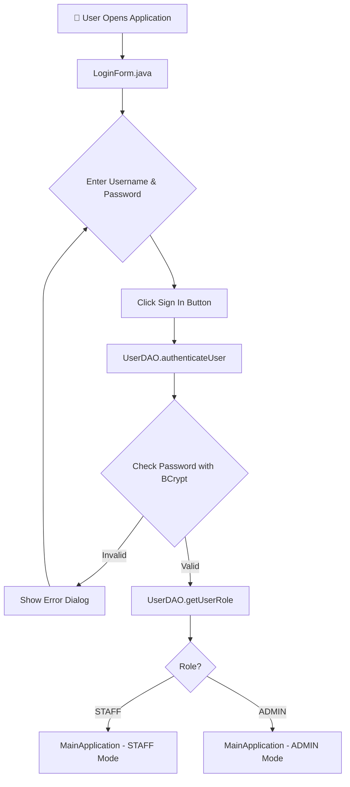

### 📁 Files Involved:
- **`view/LoginForm.java`** - Giao diện đăng nhập
- **`dao/UserDAO.java`** - Xác thực người dùng
- **`util/PasswordUtil.java`** - Mã hóa BCrypt
- **`database/DatabaseConnector.java`** - Kết nối database

---

## 👨‍💼 2. FLOW HOẠT ĐỘNG CỦA STAFF

### 🎯 2.1. Dashboard Panel (Màn hình chính)

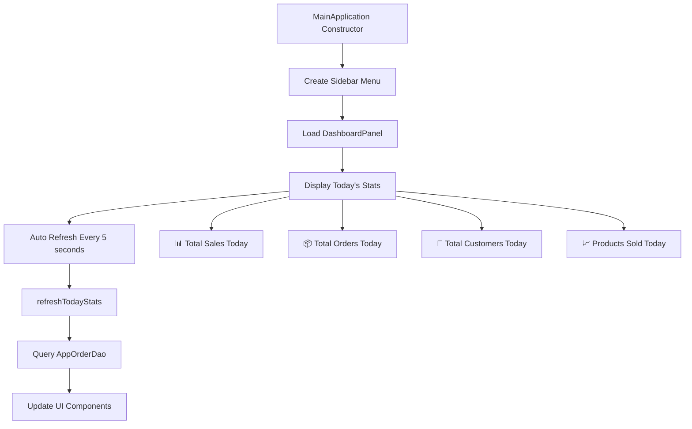

**Files:** `view/DashboardPanel.java`, `dao/AppOrderDao.java`

---

### 🛒 2.2. Order Management Flow

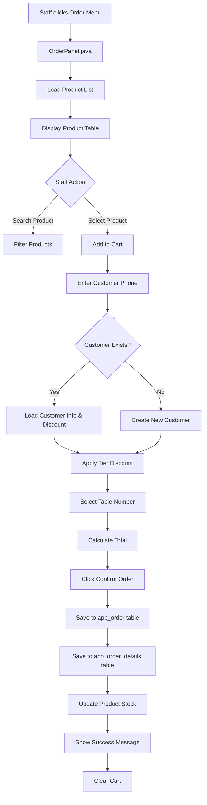

**Files:**
- `view/OrderPanel.java`
- `dao/GetProduct.java`
- `dao/AppOrderDao.java`
- `model/Order.java`
- `model/OrderDetails.java`

---

### 📦 2.3. Product Management Flow

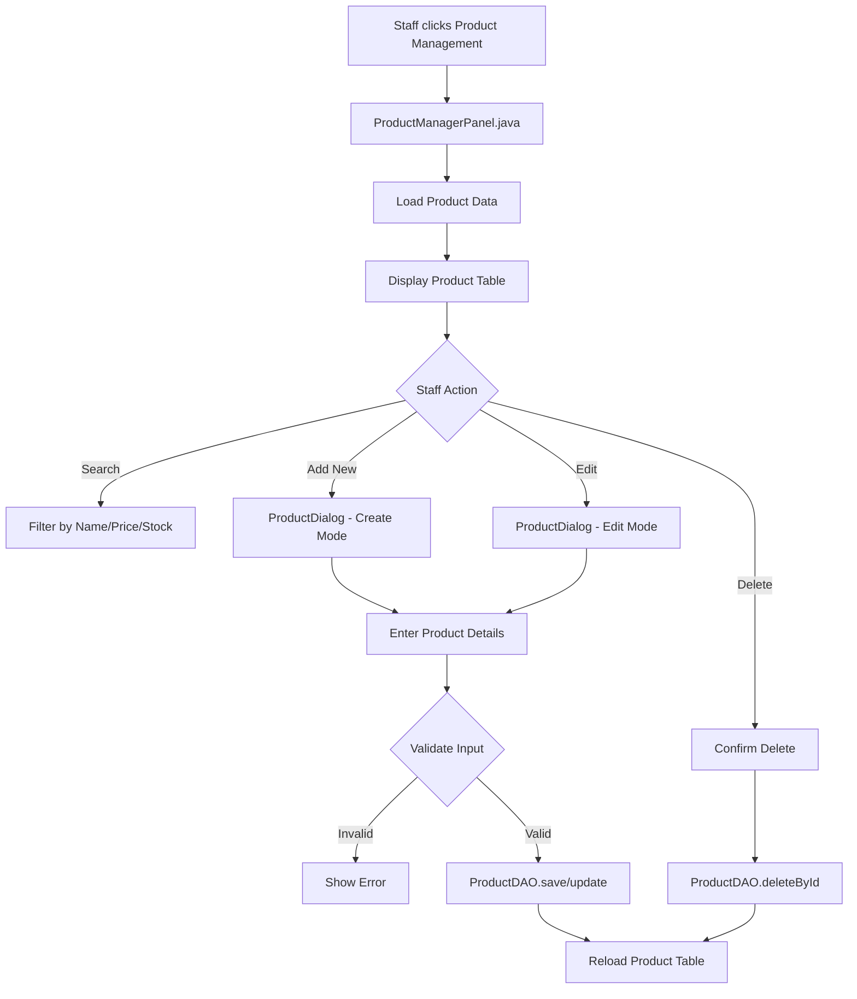

**Files:**
- `view/ProductManagerPanel.java`
- `view/ProductDialog.java`
- `dao/ProductDAO.java`
- `model/Product.java`

---

### 📋 2.4. Order Confirmation Flow

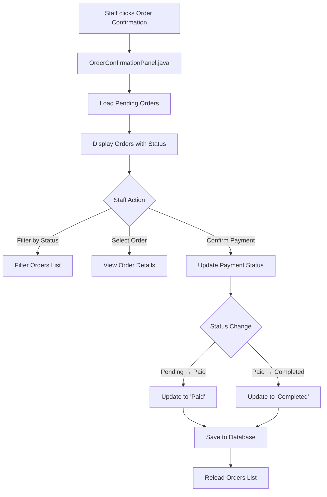

**Files:**
- `view/OrderConfirmationPanel.java`
- `dao/AppOrderDao.java`

---

### 💰 2.5. Revenue Today Flow

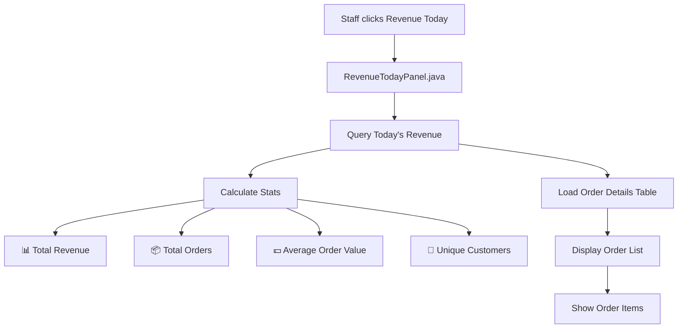

**Files:**
- `view/RevenueTodayPanel.java`
- `dao/AppOrderDao.java`

---

### 👥 2.6. Customer Management Flow

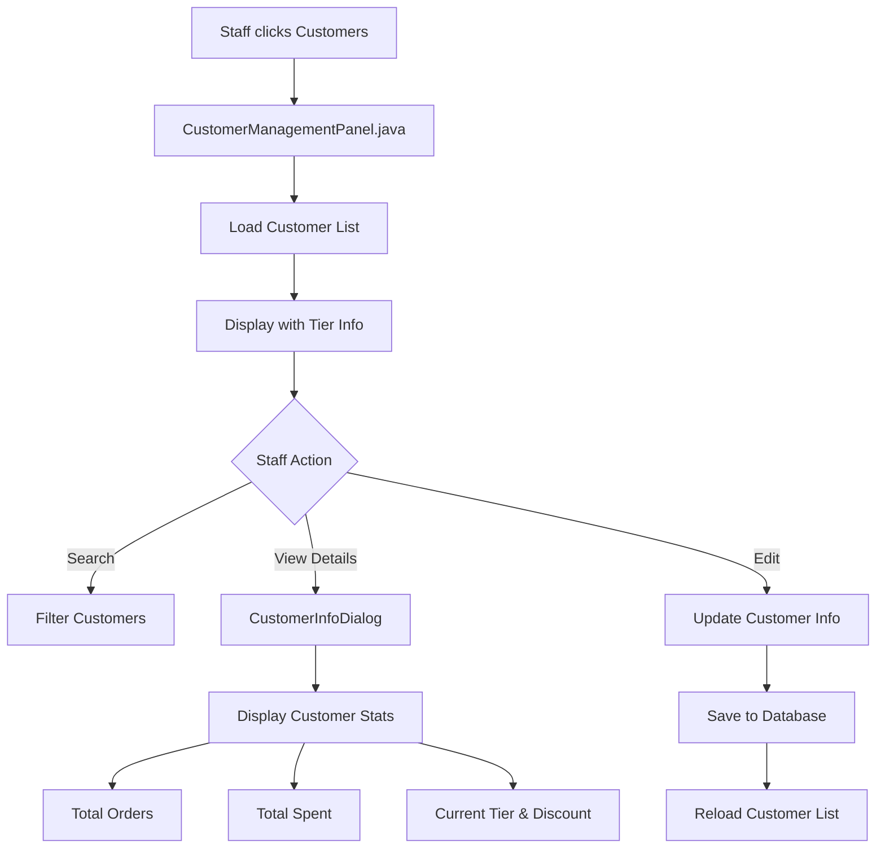

**Files:**
- `view/CustomerManagementPanel.java`
- `view/CustomerInfoDialog.java`
- `dao/CustomerDao.java`

---

## 👨‍💻 3. FLOW HOẠT ĐỘNG CỦA ADMIN

### Admin có TẤT CẢ quyền của Staff + các quyền bổ sung:

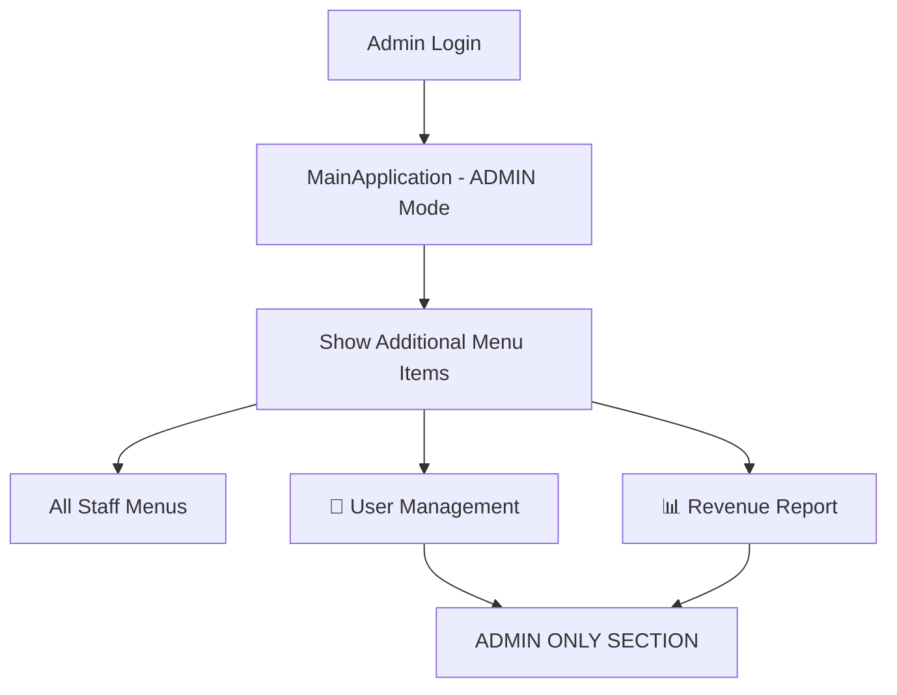

---

### 👥 3.1. User Management Flow (ADMIN ONLY)

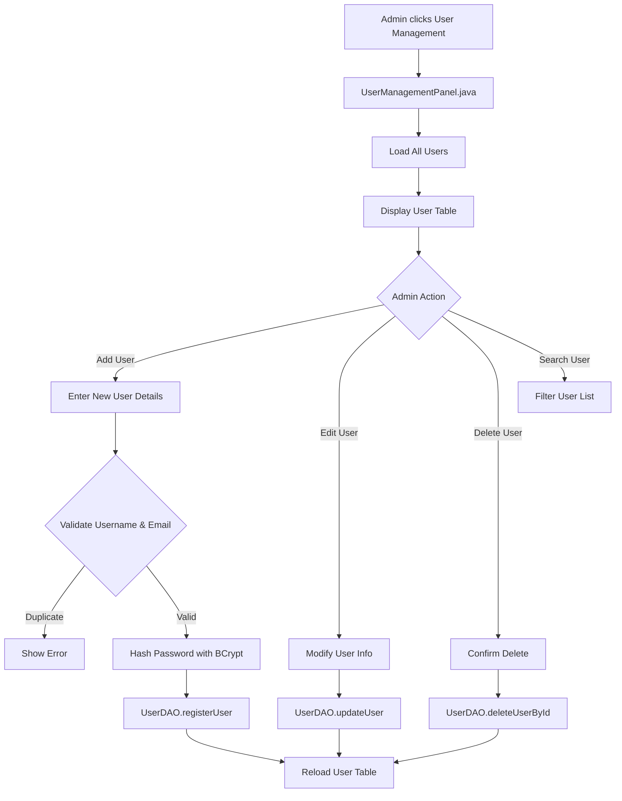

**Files:**
- `view/UserManagementPanel.java`
- `dao/UserDAO.java`
- `model/user.java`
- `util/PasswordUtil.java`

---

### 📊 3.2. Revenue Report Flow (ADMIN ONLY)

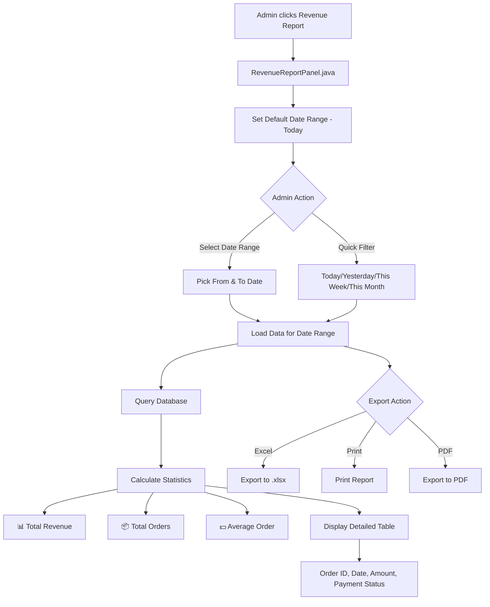

**Files:**
- `view/RevenueReportPanel.java`
- `dao/AppOrderDao.java`
- Uses Apache POI for Excel export

---

## 🔄 4. SYSTEM COMPONENTS & INTERACTIONS

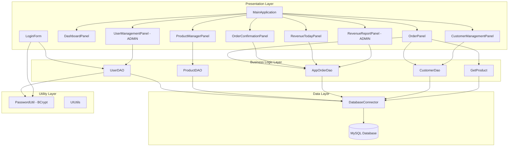

---

## 📊 5. DATABASE SCHEMA INTERACTIONS

### Tables Used:

| Table | Used By | Purpose |
|-------|---------|---------|
| `users` | UserDAO | Authentication, User Management |
| `products` | ProductDAO | Product Management |
| `app_order` | AppOrderDao | Order Management |
| `app_order_details` | AppOrderDao | Order Items |
| `customers` | CustomerDao | Customer Management |
| `customer_tiers` | CustomerDao | Loyalty Program |

---

## 🔐 6. AUTHENTICATION & AUTHORIZATION

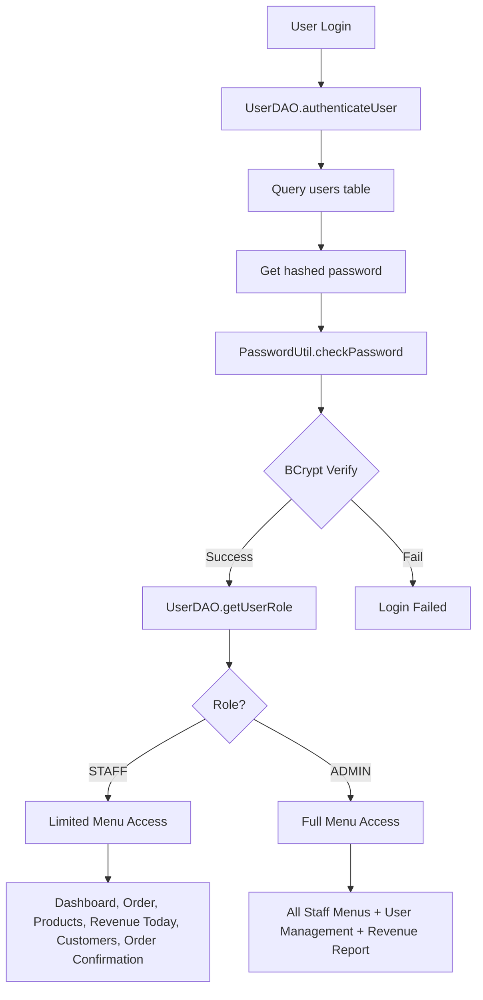

---

## 🎯 7. KEY DIFFERENCES: STAFF vs ADMIN

### 👨‍💼 STAFF Permissions:
✅ View Dashboard  
✅ Create & Manage Orders  
✅ Manage Products  
✅ Confirm Orders  
✅ View Today's Revenue  
✅ Manage Customers  
❌ User Management  
❌ Full Revenue Reports with Date Ranges  

### 👨‍💻 ADMIN Permissions:
✅ **All Staff Permissions**  
✅ **User Management** - Create, Edit, Delete Users  
✅ **Revenue Report** - View historical data with date filters  
✅ **Export Reports** - Excel, PDF, Print  

---

## 🔄 8. AUTO-REFRESH MECHANISMS

### DashboardPanel:
- Auto-refresh every **5 seconds**
- Updates: Sales, Orders, Customers, Products Sold
- Uses SwingWorker for background queries

### OrderPanel:
- Real-time product stock updates
- Customer discount calculation on phone input
- Cart total recalculation on quantity change

### OrderConfirmationPanel:
- Manual refresh on status update
- Filter by payment status (Pending, Paid, Completed)

---

## 📱 9. UI NAVIGATION FLOW

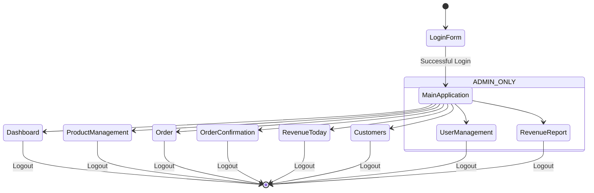

---

## 🛠️ 10. TECHNOLOGY STACK

### Frontend (Desktop):
- **Java Swing** - UI Framework
- **JFreeChart** - Charts & Graphs
- **GridBagLayout, BorderLayout** - Layouts

### Backend:
- **JDBC** - Database Connectivity
- **BCrypt** - Password Hashing
- **Apache POI** - Excel Export

### Database:
- **MySQL** - RDBMS

### Design Patterns:
- **DAO Pattern** - Data Access
- **MVC Pattern** - Architecture
- **Singleton** - Database Connector

---

## 📝 NOTES:

1. **Password Security**: Tất cả mật khẩu được hash bằng BCrypt trước khi lưu vào database
2. **Role-Based Access**: Menu items được hiển thị dựa trên role của user
3. **Real-time Updates**: Dashboard tự động refresh để cập nhật dữ liệu mới nhất
4. **Customer Loyalty**: Hệ thống tiers tự động tính discount dựa trên tổng chi tiêu
5. **Validation**: Tất cả input đều được validate trước khi lưu vào database

---

## 🚀 GETTING STARTED

### For Staff:
1. Login với username và password
2. Xem Dashboard để có overview
3. Tạo đơn hàng mới trong Order Panel
4. Xác nhận thanh toán trong Order Confirmation
5. Xem doanh thu ngày trong Revenue Today

### For Admin:
1. Login với admin account
2. Có tất cả quyền của Staff
3. Quản lý users trong User Management
4. Xem báo cáo chi tiết trong Revenue Report
5. Export dữ liệu ra Excel/PDF

---

**Tạo bởi:** GitHub Copilot  
**Ngày:** December 5, 2025  
**Version:** 1.0
