```mermaid
graph TB
    subgraph System["Shop Management System"]
        subgraph CustomerFeatures["Customer Features"]
            UC1[Register Account]
            UC2[Login]
            UC3[View Products]
            UC4[Search Products]
            UC5[Add to Cart]
            UC6[View Cart]
            UC7[Place Order]
            UC8[View Order History]
            UC9[Track Order Status]
            UC10[Update Profile]
            UC11[Change Password]
        end
        
        subgraph StaffFeatures["Staff Features"]
            UC12[Manage Products]
            UC13[Add Product]
            UC14[Edit Product]
            UC15[Delete Product]
            UC16[View Orders]
            UC17[Update Order Status]
            UC18[View Customer List]
            UC19[Generate Reports]
        end
        
        subgraph AdminFeatures["Admin Features"]
            UC20[Manage Users]
            UC21[Add User]
            UC22[Edit User]
            UC23[Delete User]
            UC24[Assign User Tier]
            UC25[Manage Categories]
            UC26[View System Statistics]
            UC27[Manage Notifications]
            UC28[System Configuration]
        end
        
        subgraph CommonFeatures["Common Features"]
            UC29[View Dashboard]
            UC30[Logout]
        end
    end
    
    Customer((Customer/User))
    Staff((Staff))
    Admin((Admin))
    
    %% Customer connections
    Customer --> UC1
    Customer --> UC2
    Customer --> UC3
    Customer --> UC4
    Customer --> UC5
    Customer --> UC6
    Customer --> UC7
    Customer --> UC8
    Customer --> UC9
    Customer --> UC10
    Customer --> UC11
    Customer --> UC30
    
    %% Staff connections
    Staff --> UC2
    Staff --> UC12
    Staff --> UC16
    Staff --> UC17
    Staff --> UC18
    Staff --> UC19
    Staff --> UC29
    Staff --> UC30
    
    %% Admin connections
    Admin --> UC2
    Admin --> UC20
    Admin --> UC24
    Admin --> UC25
    Admin --> UC26
    Admin --> UC27
    Admin --> UC28
    Admin --> UC29
    Admin --> UC30
    
    %% Include relationships
    UC12 -.->|include| UC13
    UC12 -.->|include| UC14
    UC12 -.->|include| UC15
    UC20 -.->|include| UC21
    UC20 -.->|include| UC22
    UC20 -.->|include| UC23
    
    %% Inheritance
    Staff -.->|extends| Customer
    Admin -.->|extends| Staff
    
    classDef actorStyle fill:#85C1E9,stroke:#2874A6,stroke-width:2px
    classDef usecaseStyle fill:#AED6F1,stroke:#3498DB,stroke-width:1px
    
    class Customer,Staff,Admin actorStyle
    class UC1,UC2,UC3,UC4,UC5,UC6,UC7,UC8,UC9,UC10,UC11,UC12,UC13,UC14,UC15,UC16,UC17,UC18,UC19,UC20,UC21,UC22,UC23,UC24,UC25,UC26,UC27,UC28,UC29,UC30 usecaseStyle
```

## Hướng dẫn import vào Draw.io:

### Cách 1: Sử dụng plugin Mermaid trong Draw.io
1. Mở Draw.io (https://app.diagrams.net/)
2. Chọn **Arrange** → **Insert** → **Advanced** → **Mermaid**
3. Copy toàn bộ code Mermaid (từ ```mermaid đến ```) và paste vào
4. Click **Insert**

### Cách 2: Tạo diagram thủ công
Nếu Mermaid không hoạt động tốt trong Draw.io, hãy sử dụng code dưới đây để tham khảo và vẽ thủ công:

## Use Case Summary:

### **Customer (User) - 11 Use Cases:**
- **Authentication:** Register Account, Login
- **Product Browsing:** View Products, Search Products
- **Shopping Cart:** Add to Cart, View Cart
- **Order Management:** Place Order, View Order History, Track Order Status
- **Profile:** Update Profile, Change Password
- **System:** Logout

### **Staff - 8 Primary Use Cases:**
- Inherits all Customer features
- **Product Management:** Manage Products (Add, Edit, Delete)
- **Order Processing:** View Orders, Update Order Status
- **Customer Service:** View Customer List
- **Reporting:** Generate Reports
- **System:** View Dashboard

### **Admin - 9 Primary Use Cases:**
- Inherits all Staff features
- **User Management:** Manage Users (Add, Edit, Delete)
- **Tier Management:** Assign User Tier
- **Category Management:** Manage Categories
- **System Management:** View System Statistics, Manage Notifications, System Configuration

## Relationships:
- **Inheritance:** Staff extends Customer, Admin extends Staff
- **Include:** Manage Products includes (Add, Edit, Delete Product)
- **Include:** Manage Users includes (Add, Edit, Delete User)
```
